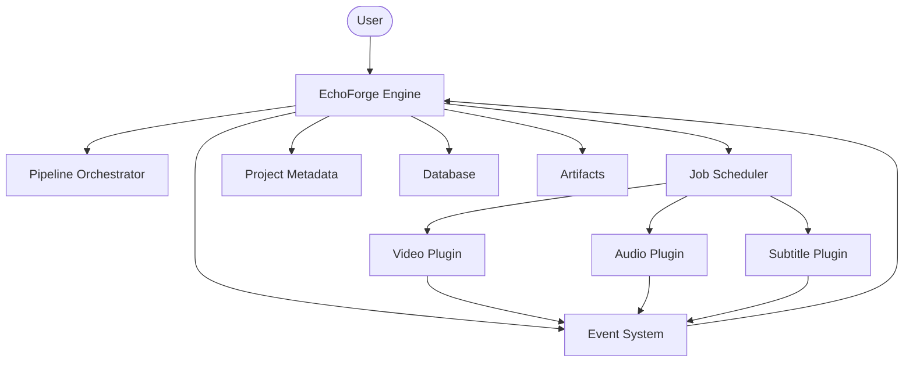
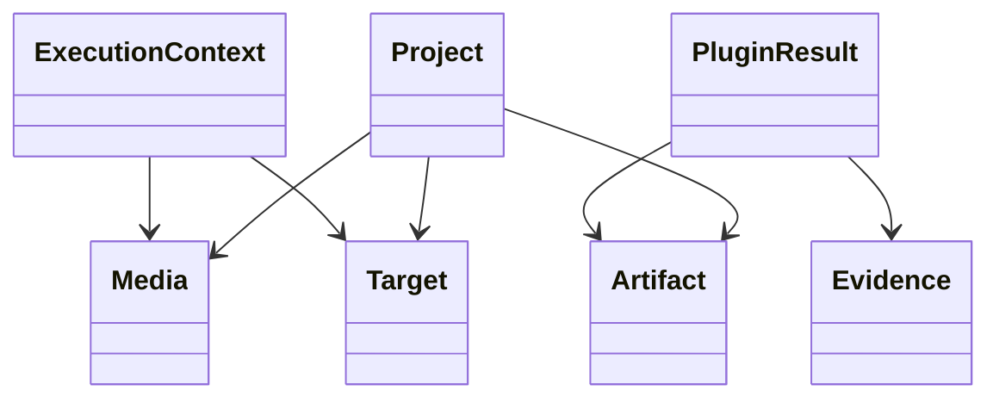
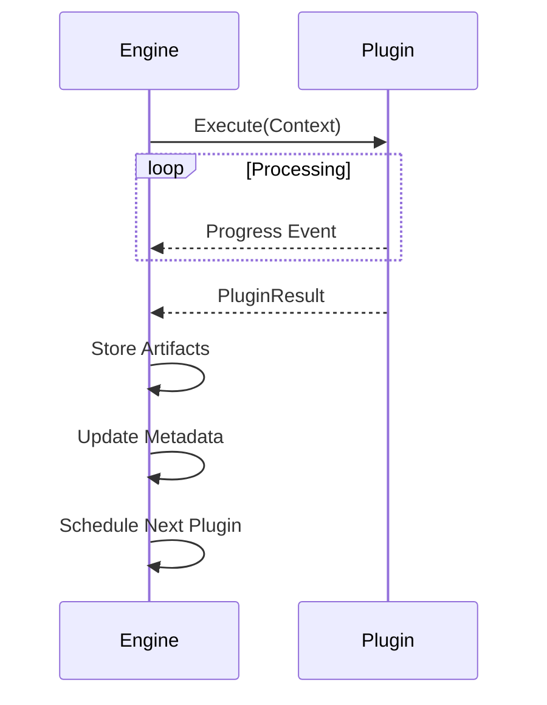
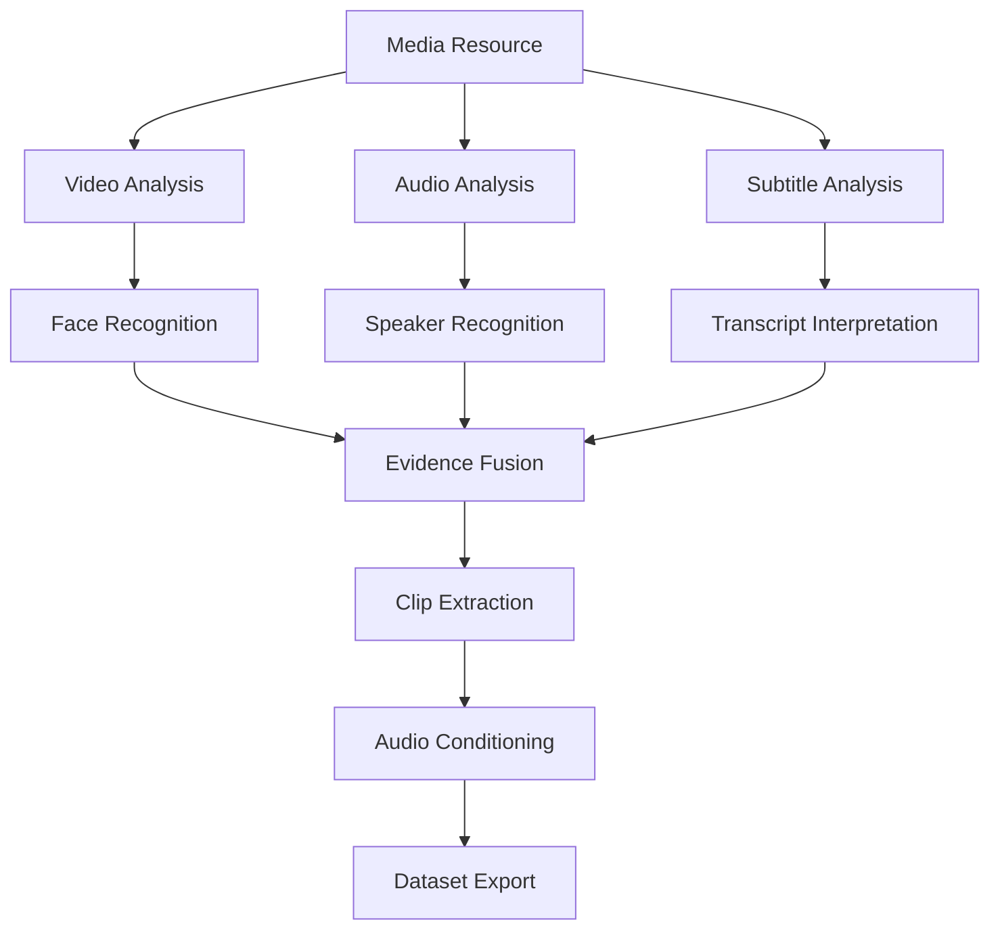

<!--
===============================================================================
EchoForge Architecture Diagrams
-------------------------------------------------------------------------------

Purpose:

Visual documentation of the EchoForge framework.

These diagrams complement the textual documentation found in
architecture.md, plugin_api.md, and data_model.md.

The diagrams should be treated as architectural specifications.
Whenever the implementation changes, these diagrams should be updated
to remain consistent with the source code.

===============================================================================
-->

## 1. System Architecture

## 2. Core Data Model

## 3. Plugin Execution Sequence

## 4. Processing Dependency Graph

project/

├── project.yaml

├── database/

├── metadata/

├── cache/

├── artifacts/

├── reports/

├── logs/

└── exports/
